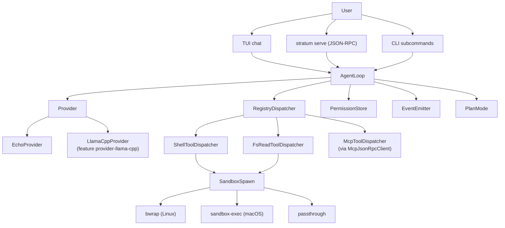

# Stratum Architecture

This document is the **published** architecture overview. The private design corpus lives at `plan/` (gitignored, never published).

## High-level



## Per-turn lifecycle

```mermaid
sequenceDiagram
  participant U as User
  participant Chat as ChatState
  participant Loop as AgentLoop
  participant Router as IntentRouter
  participant Prov as Provider
  participant Disp as RegistryDispatcher
  participant Perm as PermissionStore

  U->>Chat: submit("hello")
  Chat->>Loop: run_turn(ctx, cancel)
  Loop->>Router: classify("hello")
  Router-->>Loop: RoutedIntent
  Loop->>Prov: generate(req, cancel)
  Prov-->>Loop: blocks
  loop For each Block::ToolCall
    Loop->>Perm: evaluate_permission(req)
    Perm-->>Loop: PermissionDecision
    alt AllowAny
      Loop->>Disp: dispatch(invocation)
      Disp-->>Loop: ToolResult
    else Deny
      Loop->>Loop: TurnEvent::DenyTool
    end
  end
  Loop-->>Chat: TurnResult
  Chat->>U: render(blocks)
```

## Module map (runtime crate)

| Module                        | Role                                                         |
|---|---|
| `agent_loop`                  | Keystone: orchestrates a single turn (FSM, dispatch, events) |
| `agent_factory`               | Fluent builder over `AgentLoop`                              |
| `agent_session`               | Persistent multi-turn wrapper (transcript + emitter)         |
| `agent_handoff`               | Multi-role coordinator (handoff sentinels)                   |
| `agent_registry_loader`       | Loads `<state>/agents/*.toml` into `AgentRegistry`           |
| `conversation`                | `TurnDriver` FSM (Idle -> Generating -> ... -> Done)         |
| `provider`                    | `Provider` trait + `EchoProvider`                            |
| `llama_provider`              | `LlamaCppProvider` (feature `provider-llama-cpp`)            |
| `intent_router`               | Prompt -> `RoutedIntent` classification                      |
| `permission_prompt`           | `PermissionStore` + responder trait                          |
| `event_log`                   | `EventEmitter` over `MemoryEventSink` / `JsonlEventSink`     |
| `plan_mode`                   | Capability fence (`/plan` toggle)                            |
| `tool_invocation`             | `ToolDispatcher` trait + `RegistryDispatcher`                |
| `tool_dispatchers`            | `ShellToolDispatcher`, `FsReadToolDispatcher`                |
| `tool_dispatcher_mcp`         | Bridges MCP server tools through a `ToolDispatcher`          |
| `mcp`, `mcp_jsonrpc`          | MCP stdio session + JSON-RPC client                          |
| `sandbox`, `sandbox_resolve`, `sandbox_profile` | bwrap / sandbox-exec spawn + resolution      |
| `serve_protocol`, `serve_server`, `serve_handler_agent`, `serve_middleware` | JSON-RPC daemon stack |
| `model_catalog`, `model_resolver`, `catalog_sync`, `download` | Model registry + HTTPS fetch + integrity        |
| `update_manifest`             | `stratum self-update` data shape                             |
| `install`                     | `installed.toml` first-run marker + load/save                |
| `transcript`                  | On-disk transcript persistence                               |
| `observability`               | Per-turn metrics (`TurnRecorder`)                            |
| `budget`, `budget_meter`      | In-turn + session-level budget tracking                      |
| `retry`, `rate_limit`         | Backoff + token-bucket                                       |
| `prompt_template`, `prompt_cache` | Prompt assembly + reuse                                  |
| `embedder`, `rag`, `rag_index_builder`, `rag_query` | RAG pipeline scaffolding                  |
| `eval_runner`, `claude_cli_judge` | Eval framework + LLM-judge transport                     |
| `i18n`                        | Locale catalog scaffold                                      |
| `crash_report`, `panic`       | Opt-in crash bundle + redacted log tail                      |
| `telemetry`                   | Default-on opt-out anonymous metrics                         |
| `secrets`                     | `SecretStore` trait + `InMemorySecretStore`                  |
| `paths`, `probe`, `tier`, `prompts`, `logging` | Misc plumbing                                  |

## Boundaries

- **Synchronous**: every runtime trait is sync. Provider, ToolDispatcher, PromptResponder, ServeHandler all return `T` directly. The daemon spawns one OS thread per connection.
- **No async runtime**: no tokio, no async-std. Concurrency = `std::thread` + `Mutex`/`Condvar`/`mpsc`.
- **No `unsafe`**: workspace `lints.rust.unsafe_code = "deny"`.
- **No `unwrap`/`expect`/`panic` outside `#[cfg(test)]`**: workspace clippy denies; documented carve-outs in `docs/coverage-exclusions.md`.

## Plan-mode boundary

`PlanMode` gates capabilities the agent loop is allowed to invoke. When active, `enforce_plan_mode_on_request(cap)` rejects `fs.write`, `fs.delete`, `shell.exec`, `net.fetch`, `process.spawn`, `mcp.write` and any wildcard match. Read-only browsing of the workspace is always allowed.

## Sandbox boundary

`SandboxSpawn` is the only path that constructs a `std::process::Command` for tool-call subprocesses. It dispatches by `SandboxBackend`:

- `Bwrap` (Linux): builds `--ro-bind`, `--bind`, `--tmpfs`, `--unshare-net`, `--clearenv`, `--setenv`, `--chdir` args; spawns `bwrap` from `PATH`.
- `SandboxExec` (macOS): synthesises a `.sb` profile in a `TempDir`; spawns `sandbox-exec -f <profile>`.
- `WindowsJob`: returns `Unsupported`.
- `Passthrough`: no isolation - for dev / testing only.

## Permission boundary

Three planes:
1. `CapabilityMatrix` - declarative allow/deny per tool, loaded from `<state>/capabilities.toml`.
2. `PlanMode` - runtime toggle that strips write-bearing capabilities from the matrix.
3. `PermissionStore` - per-request interactive decisions (`AllowOnce` / `AllowSession` / `AllowForever` / `Deny` / `DenyForever`) with TUI prompter.

Each tool dispatch flows through all three. Failing any plane = `ToolFailure`.

## Daemon stack

```
TcpListener / UnixListener
        |
   per-connection thread
        |
   parse_request (serve_protocol)
        |
   LoggingHandler (optional)
        |
   AuthTokenHandler (optional)
        |
   RateLimitedHandler (optional)
        |
   AgentServeHandler
        |
   AgentSession (per session_id)
        |
   AgentLoop.run_turn
        |
   render_response
```

Each layer is an `Arc<dyn ServeHandler>` and composes through `serve_middleware::chain`.

## What's NOT here

- **Async runtime / streaming**: future work. Currently every turn is fully buffered.
- **Distributed agents**: serve daemon is single-process. Coordination across machines is out of scope.
- **GUI**: only TUI + JSON-RPC. Mobile (Phase 8) is deferred.
- **Trained model bundling**: feature-gated build only. No GGUF ships in the binary.

See `plan/` (private) for the full design history.
